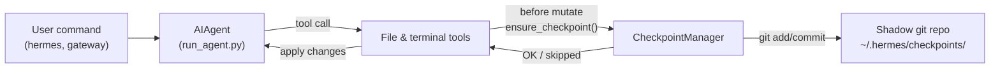

# 检查点和 /rollback

Hermes Agent 在**破坏性操作**之前自动快照你的项目，并让你用单个命令恢复。检查点**默认启用**——当没有文件修改工具触发时零成本。

这个安全网由内部 **Checkpoint Manager** 提供支持，它在 `~/.hermes/checkpoints/` 下维护一个单独的影子 git 仓库——你的真实项目 `.git` 永远不会被触碰。

## 什么触发检查点

检查点自动在以下之前拍摄：

- **文件工具** — `write_file` 和 `patch`
- **破坏性终端命令** — `rm`、`mv`、`sed -i`、`truncate`、`shred`、输出重定向（`>`）以及 `git reset`/`clean`/`checkout`

代理每个目录每个回合最多创建一个检查点，因此长时间运行的会话不会垃圾快照。

## 快速参考

| 命令 | 描述 |
|--------|-------------|
| `/rollback` | 列出所有带有更改统计的检查点 |
| `/rollback <N>` | 恢复到检查点 N（也撤销最后一个聊天回合） |
| `/rollback diff <N>` | 预览检查点 N 和当前状态之间的差异 |
| `/rollback <N> <file>` | 从检查点 N 恢复单个文件 |

## 检查点如何工作

在高层次上：

- Hermes 检测到工具何时即将**修改**你工作树中的文件。
- 每次对话回合（每个目录），它会：
  - 解析文件的合理项目根目录。
  - 初始化或重用绑定到该目录的**影子 git 仓库**。
  - 用简短的人类可读原因暂存并提交当前状态。
- 这些提交形成检查点历史，你可以检查并通过 `/rollback` 恢复。



## 配置

检查点默认启用。在 `~/.hermes/config.yaml` 中配置：

```yaml
checkpoints:
  enabled: true          # 主开关（默认：true）
  max_snapshots: 50      # 每个目录的最大检查点数
```

要禁用：

```yaml
checkpoints:
  enabled: false
```

禁用时，Checkpoint Manager 是一个空操作，永远不会尝试 git 操作。

## 列出检查点

从 CLI 会话：

```
/rollback
```

Hermes 回复一个格式化列表，显示更改统计：

```text
📸 Checkpoints for /path/to/project:

  1. 4270a8c  2026-03-16 04:36  before patch  (1 file, +1/-0)
  2. eaf4c1f  2026-03-16 04:35  before write_file
  3. b3f9d2e  2026-03-16 04:34  before terminal: sed -i s/old/new/ config.py  (1 file, +1/-1)

  /rollback <N>             恢复到检查点 N
  /rollback diff <N>        预览检查点 N 以来的更改
  /rollback <N> <file>      从检查点 N 恢复单个文件
```

每个条目显示：

- 短哈希
- 时间戳
- 原因（什么触发了快照）
- 更改摘要（更改的文件、插入/删除）

## 使用 `/rollback diff` 预览更改

在提交恢复之前，预览自检查点以来发生了什么变化：

```
/rollback diff 1
```

这显示 git diff 统计摘要，然后是实际差异：

```text
test.py | 2 +-
 1 file changed, 1 insertion(+), 1 deletion(-)

diff --git a/test.py b/test.py
--- a/test.py
+++ b/test.py
@@ -1 +1 @@
-print('original content')
+print('modified content')
```

长差异被限制在 80 行以避免淹没终端。

## 使用 `/rollback` 恢复

按编号恢复到检查点：

```
/rollback 1
```

在幕后，Hermes：

1. 验证目标提交存在于影子仓库中。
2. 拍摄当前状态的**预回滚快照**，以便你之后可以"撤销撤销"。
3. 恢复你工作目录中的跟踪文件。
4. **撤销最后一个对话回合**，以便代理的上下文与恢复的文件系统状态匹配。

成功后：

```text
✅ Restored to checkpoint 4270a8c5: before patch
A pre-rollback snapshot was saved automatically.
(^_^)b Undid 4 message(s). Removed: "Now update test.py to ..."
  4 message(s) remaining in history.
  Chat turn undone to match restored file state.
```

对话撤销确保代理不会"记住"已被回滚的更改，避免下一次回合时出现混淆。

## 单文件恢复

仅从检查点恢复一个文件而不影响目录的其余部分：

```
/rollback 1 src/broken_file.py
```

当代理更改了多个文件但只需要恢复其中一个时，这很有用。

## 安全和性能保护

为保持检查点既安全又快速，Hermes 应用了几条保护措施：

- **Git 可用性** — 如果 `git` 未在 `PATH` 中找到，检查点被透明禁用。
- **目录范围** — Hermes 跳过过于宽泛的目录（根 `/`、主目录 `$HOME`）。
- **仓库大小** — 超过 50,000 个文件的目录被跳过以避免慢速 git 操作。
- **无更改快照** — 如果自上次快照以来没有更改，跳过检查点。
- **非致命错误** — Checkpoint Manager 内的所有错误都在调试级别记录；你的工具继续运行。

## 检查点存储位置

所有影子仓库位于：

```text
~/.hermes/checkpoints/
  ├── <hash1>/   # 一个工作目录的影子 git 仓库
  ├── <hash2>/
  └── ...
```

每个 `<hash>` 来自工作目录的绝对路径。在每个影子仓库中你会发现：

- 标准 git 内部文件（`HEAD`、`refs/`、`objects/`）
- 一个 `info/exclude` 文件，包含精心策划的忽略列表
- 一个 `HERMES_WORKDIR` 文件，指回原始项目根目录

你通常永远不需要手动触碰这些。

## 最佳实践

- **保持检查点启用** — 它们默认开启，在没有文件被修改时零成本。
- **恢复前使用 `/rollback diff`** — 预览将会发生什么变化以选择正确的检查点。
- **使用 `/rollback` 而不是 `git reset`** 当你只想撤销代理驱动的更改时。
- **与 Git worktree 结合使用** 以获得最大安全性——将每个 Hermes 会话保持在自己的 worktree/分支中，检查点作为额外层。

关于在同一仓库上并行运行多个代理，参见 [Git worktree](./git-worktrees.md) 指南。
