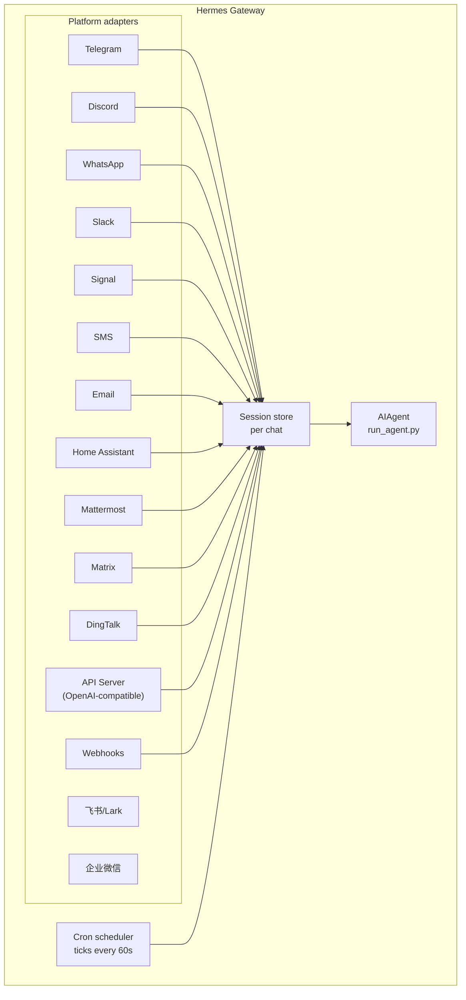

# 消息网关

从 Telegram、Discord、Slack、WhatsApp、Signal、SMS、Email、Home Assistant、Mattermost、Matrix、DingTalk、飞书/Lark、企业微信，或您的浏览器与 Hermes 聊天。网关是一个单一的后台进程，连接到您所有已配置的平台，处理会话、运行 cron 作业并传递语音消息。

有关完整语音功能集 — 包括 CLI 麦克风模式、消息中的语音回复和 Discord 语音频道对话 — 请参见[语音模式](/docs/user-guide/features/voice-mode)和[将语音模式与 Hermes 结合使用](/docs/guides/use-voice-mode-with-hermes)。

## 平台对比

| 平台 | 语音 | 图片 | 文件 | 线程 | 反应 | 打字中 | 流式 |
|----------|:-----:|:------:|:-----:|:-------:|:---------:|:------:|:---------:|
| Telegram | ✅ | ✅ | ✅ | ✅ | — | ✅ | ✅ |
| Discord | ✅ | ✅ | ✅ | ✅ | ✅ | ✅ | ✅ |
| Slack | ✅ | ✅ | ✅ | ✅ | ✅ | ✅ | ✅ |
| WhatsApp | — | ✅ | ✅ | — | — | ✅ | ✅ |
| Signal | — | ✅ | ✅ | — | — | ✅ | ✅ |
| SMS | — | — | — | — | — | — | — |
| Email | — | ✅ | ✅ | ✅ | — | — | — |
| Home Assistant | — | — | — | — | — | — | — |
| Mattermost | ✅ | ✅ | ✅ | ✅ | — | ✅ | ✅ |
| Matrix | ✅ | ✅ | ✅ | ✅ | — | ✅ | ✅ |
| DingTalk | — | — | — | — | — | ✅ | ✅ |
| 飞书/Lark | ✅ | ✅ | ✅ | ✅ | ✅ | ✅ | ✅ |
| 企业微信 | ✅ | ✅ | ✅ | — | — | ✅ | ✅ |

**语音** = TTS 音频回复和/或语音消息转录。**图片** = 发送/接收图片。**文件** = 发送/接收文件附件。**线程** = 线程对话。**反应** = 消息的 emoji 反应。**打字中** = 处理时显示打字指示器。**流式** = 通过编辑进行渐进式消息更新。

## 架构



每个平台适配器接收消息，通过每个聊天的会话存储路由，并将它们分派给 AIAgent 进行处理。网关还运行 cron 调度器，每 60 秒触发一次以执行到期的作业。

## 快速设置

配置消息平台的最简单方式是交互式向导：

```bash
hermes gateway setup        # 交互式设置所有消息平台
```

这将引导您使用方向键选择配置每个平台，显示哪些平台已配置，并在完成后提供启动/重启网关的选项。

## 网关命令

```bash
hermes gateway              # 在前台运行
hermes gateway setup        # 交互式配置消息平台
hermes gateway install      # 安装为用户服务（Linux）/ launchd 服务（macOS）
sudo hermes gateway install --system   # 仅 Linux：安装启动时系统服务
hermes gateway start        # 启动默认服务
hermes gateway stop         # 停止默认服务
hermes gateway status       # 检查默认服务状态
hermes gateway status --system         # 仅 Linux：显式检查系统服务
```

## 聊天命令（消息平台内）

| 命令 | 描述 |
|---------|-------------|
| `/new` 或 `/reset` | 开始新的对话 |
| `/model [provider:model]` | 显示或更改模型（支持 `provider:model` 语法） |
| `/provider` | 显示具有认证状态的可用 provider |
| `/personality [name]` | 设置人格 |
| `/retry` | 重试上一条消息 |
| `/undo` | 删除最后一次交换 |
| `/status` | 显示会话信息 |
| `/stop` | 停止正在运行的代理 |
| `/approve` | 批准待处理的危险命令 |
| `/deny` | 拒绝待处理的危险命令 |
| `/sethome` | 将此聊天设置为主频道 |
| `/compress` | 手动压缩对话上下文 |
| `/title [name]` | 设置或显示会话标题 |
| `/resume [name]` | 恢复之前命名的会话 |
| `/usage` | 显示此会话的令牌使用量 |
| `/insights [days]` | 显示使用洞察和分析 |
| `/reasoning [level\|show\|hide]` | 更改推理 effort 或切换推理显示 |
| `/voice [on\|off\|tts\|join\|leave\|status]` | 控制消息语音回复和 Discord 语音频道行为 |
| `/rollback [number]` | 列出或恢复文件系统检查点 |
| `/background <prompt>` | 在单独的后台会话中运行提示 |
| `/reload-mcp` | 从配置重新加载 MCP 服务器 |
| `/update` | 将 Hermes Agent 更新到最新版本 |
| `/help` | 显示可用命令 |
| `/<skill-name>` | 调用任何已安装的技能 |

## 会话管理

### 会话持久化

会话在重置之前持续跨消息存在。代理会记住您的对话上下文。

### 重置策略

会话基于可配置的策略重置：

| 策略 | 默认 | 描述 |
|--------|---------|-------------|
| 每日 | 凌晨 4:00 | 每天在特定小时重置 |
| 空闲 | 1440 分钟 | N 分钟不活动后重置 |
| 两者 |（组合）| 以先触发者为准 |

在 `~/.hermes/gateway.json` 中配置每个平台的覆盖：

```json
{
  "reset_by_platform": {
    "telegram": { "mode": "idle", "idle_minutes": 240 },
    "discord": { "mode": "idle", "idle_minutes": 60 }
  }
}
```

## 安全性

**默认情况下，网关拒绝所有不在白名单中或未通过私信配对的用户。** 这是对具有终端访问权限的机器人而言的安全默认值。

```bash
# 限制为特定用户（推荐）：
TELEGRAM_ALLOWED_USERS=123456789,987654321
DISCORD_ALLOWED_USERS=123456789012345678
SIGNAL_ALLOWED_USERS=+155****4567,+155****6543
SMS_ALLOWED_USERS=+155****4567,+155****6543
EMAIL_ALLOWED_USERS=trusted@example.com,colleague@work.com
MATTERMOST_ALLOWED_USERS=3uo8dkh1p7g1mfk49ear5fzs5c
MATRIX_ALLOWED_USERS=@alice:matrix.org
DINGTALK_ALLOWED_USERS=user-id-1

# 或允许所有人
GATEWAY_ALLOWED_USERS=123456789,987654321

# 或显式允许所有用户（不建议用于具有终端访问权限的机器人）：
GATEWAY_ALLOW_ALL_USERS=true
```

### 私信配对（白名单的替代方案）

无需手动配置用户 ID，未知用户在向机器人发送私信时会收到一次性配对码：

```bash
# 用户看到："配对码：XKGH5N7P"
# 您使用以下命令批准他们：
hermes pairing approve telegram XKGH5N7P

# 其他配对命令：
hermes pairing list          # 查看待批准 + 已批准的用户
hermes pairing revoke telegram 123456789  # 移除访问权限
```

配对码在 1 小时后过期，受速率限制，并使用加密随机性。

## 中断代理

在代理工作时发送任何消息以中断它。关键行为：

- **正在进行的终端命令会立即终止**（SIGTERM，1 秒后 SIGKILL）
- **工具调用被取消** — 仅当前正在执行的那个运行，其余被跳过
- **多条消息被合并** — 在中断期间发送的消息被加入一个提示
- **`/stop` 命令** — 中断而不排队后续消息

## 工具进度通知

在 `~/.hermes/config.yaml` 中控制显示多少工具活动：

```yaml
display:
  tool_progress: all    # off | new | all | verbose
  tool_progress_command: false  # 设置为 true 以在消息中启用 /verbose
```

启用后，机器人在工作时发送状态消息：

```text
💻 `ls -la`...
🔍 web_search...
📄 web_extract...
🐍 execute_code...
```

## 后台会话

在单独的后台会话中运行提示，以便代理独立处理，而您的主聊天保持响应：

```
/background 检查集群中的所有服务器并报告任何宕机的服务器
```

Hermes 立即确认：

```
🔄 后台任务已启动："检查集群中的所有服务器..."
   任务 ID: bg_143022_a1b2c3
```

### 工作原理

每个 `/background` 提示生成一个**独立的代理实例**，异步运行：

- **隔离的会话** — 后台代理拥有自己的会话和自己的对话历史。它不了解您当前聊天的上下文，仅接收您提供的提示。
- **相同的配置** — 从当前网关设置继承您的模型、provider、工具集、推理设置和 provider 路由。
- **非阻塞** — 您的主聊天保持完全交互。在它工作时发送消息、运行其他命令或启动更多后台任务。
- **结果传递** — 任务完成后，结果发送到**发出命令的同一聊天或频道**，前缀为"✅ 后台任务完成"。如果失败，您将看到"❌ 后台任务失败"以及错误。

### 后台进程通知

当运行后台会话的代理使用 `terminal(background=true)` 启动长时间运行的进程（服务器、构建等）时，网关可以将状态更新推送到您的聊天。使用 `~/.hermes/config.yaml` 中的 `display.background_process_notifications` 控制：

```yaml
display:
  background_process_notifications: all    # all | result | error | off
```

| 模式 | 您收到的内容 |
|------|-----------------|
| `all` | 运行输出更新**以及**最终完成消息（默认） |
| `result` | 仅最终完成消息（无论退出代码如何） |
| `error` | 仅在退出代码非零时的最终消息 |
| `off` | 完全不发送进程观察者消息 |

您也可以通过环境变量设置：

```bash
HERMES_BACKGROUND_NOTIFICATIONS=result
```

### 使用场景

- **服务器监控** — "/background 检查所有服务的健康状况，如有异常提醒我"
- **长时间构建** — "/background 构建并部署暂存环境"而您继续聊天
- **研究任务** — "/background 研究竞争对手的定价并总结成表格"
- **文件操作** — "/background 按日期组织 ~/Downloads 中的照片到文件夹"

:::tip
消息平台上的后台任务是即发即忘 — 您无需等待或检查它们。任务完成后结果会自动到达同一聊天。
:::

## 服务管理

### Linux（systemd）

```bash
hermes gateway install               # 安装为用户服务
hermes gateway start                 # 启动服务
hermes gateway stop                  # 停止服务
hermes gateway status                # 检查状态
journalctl --user -u hermes-gateway -f  # 查看日志

# 启用 lingering（ logout 后保持运行）
sudo loginctl enable-linger $USER

# 或安装启动时系统服务（仍以您的用户身份运行）
sudo hermes gateway install --system
sudo hermes gateway start --system
sudo hermes gateway status --system
journalctl -u hermes-gateway -f
```

在笔记本电脑和开发机上使用用户服务。在 VPS 或无头主机上使用系统服务，这些主机应该在启动时恢复而不依赖 systemd linger。

除非您真的打算，否则避免同时保留用户和系统网关单元。Hermes 会在检测到两者时发出警告，因为 start/stop/status 行为会变得模糊。

:::info 多个安装
如果您在同一台机器上运行多个 Hermes 安装（使用不同的 `HERMES_HOME` 目录），每个安装都会获得自己的 systemd 服务名称。默认的 `~/.hermes` 使用 `hermes-gateway`；其他安装使用 `hermes-gateway-<hash>`。`hermes gateway` 命令自动针对您当前 `HERMES_HOME` 的正确服务。
:::

### macOS（launchd）

```bash
hermes gateway install               # 安装为 launchd agent
hermes gateway start                 # 启动服务
hermes gateway stop                  # 停止服务
hermes gateway status                # 检查状态
tail -f ~/.hermes/logs/gateway.log   # 查看日志
```

生成的 plist 位于 `~/Library/LaunchAgents/ai.hermes.gateway.plist`。它包含三个环境变量：

- **PATH** — 安装时您的完整 shell PATH，venv `bin/` 和 `node_modules/.bin` 预置。这确保用户安装的工具（Node.js、ffmpeg 等）可用于网关子进程，如 WhatsApp bridge。
- **VIRTUAL_ENV** — 指向 Python virtualenv，以便工具正确解析包。
- **HERMES_HOME** — 将网关限定到您的 Hermes 安装。

:::tip 安装后 PATH 更改
launchd plist 是静态的 — 如果在设置网关后安装了新工具（例如通过 nvm 安装的新 Node.js 版本，或通过 Homebrew 安装的 ffmpeg），请重新运行 `hermes gateway install` 以捕获更新的 PATH。网关将检测到过时的 plist 并自动重新加载。
:::

:::info 多个安装
与 Linux systemd 服务一样，每个 `HERMES_HOME` 目录获得自己的 launchd 标签。默认的 `~/.hermes` 使用 `ai.hermes.gateway`；其他安装使用 `ai.hermes.gateway-<suffix>`。
:::

## 平台特定工具集

每个平台都有自己的工具集：

| 平台 | 工具集 | 能力 |
|----------|---------|--------------|
| CLI | `hermes-cli` | 完全访问 |
| Telegram | `hermes-telegram` | 包含终端的完整工具 |
| Discord | `hermes-discord` | 包含终端的完整工具 |
| WhatsApp | `hermes-whatsapp` | 包含终端的完整工具 |
| Slack | `hermes-slack` | 包含终端的完整工具 |
| Signal | `hermes-signal` | 包含终端的完整工具 |
| SMS | `hermes-sms` | 包含终端的完整工具 |
| Email | `hermes-email` | 包含终端的完整工具 |
| Home Assistant | `hermes-homeassistant` | 完整工具 + HA 设备控制（ha_list_entities、ha_get_state、ha_call_service、ha_list_services） |
| Mattermost | `hermes-mattermost` | 包含终端的完整工具 |
| Matrix | `hermes-matrix` | 包含终端的完整工具 |
| DingTalk | `hermes-dingtalk` | 包含终端的完整工具 |
| 飞书/Lark | `hermes-feishu` | 包含终端的完整工具 |
| 企业微信 | `hermes-wecom` | 包含终端的完整工具 |
| API Server | `hermes`（默认） | 包含终端的完整工具 |
| Webhooks | `hermes-webhook` | 包含终端的完整工具 |

## 下一步

- [Telegram 设置](telegram.md)
- [Discord 设置](discord.md)
- [Slack 设置](slack.md)
- [WhatsApp 设置](whatsapp.md)
- [Signal 设置](signal.md)
- [SMS 设置（Twilio）](sms.md)
- [Email 设置](email.md)
- [Home Assistant 集成](homeassistant.md)
- [Mattermost 设置](mattermost.md)
- [Matrix 设置](matrix.md)
- [DingTalk 设置](dingtalk.md)
- [飞书/Lark 设置](feishu.md)
- [企业微信设置](wecom.md)
- [Open WebUI + API Server](open-webui.md)
- [Webhooks](webhooks.md)
