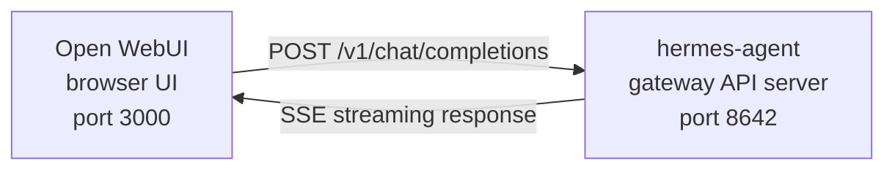

# Open WebUI 集成

[Open WebUI](https://github.com/open-webui/open-webui)（126k★）是最流行的自托管 AI 聊天界面。通过 Hermes Agent 内置的 API 服务器，您可以使用 Open WebUI 作为代理的精美 Web 前端——包括对话管理、用户账户和现代聊天界面。

## 架构



Open WebUI 连接到 Hermes Agent 的 API 服务器，就像连接 OpenAI 一样。您的代理使用其完整工具集处理请求——终端、文件操作、网络搜索、记忆、技能——并返回最终响应。

Open WebUI 与 Hermes 服务器对服务器通信，因此此集成不需要 `API_SERVER_CORS_ORIGINS`。

## 快速设置

### 1. 启用 API 服务器

添加到 `~/.hermes/.env`：

```bash
API_SERVER_ENABLED=true
API_SERVER_KEY=your-secret-key
```

### 2. 启动 Hermes Agent 网关

```bash
hermes gateway
```

您应该看到：

```
[API Server] API server listening on http://127.0.0.1:8642
```

### 3. 启动 Open WebUI

```bash
docker run -d -p 3000:8080 \
  -e OPENAI_API_BASE_URL=http://host.docker.internal:8642/v1 \
  -e OPENAI_API_KEY=your-secret-key \
  --add-host=host.docker.internal:host-gateway \
  -v open-webui:/app/backend/data \
  --name open-webui \
  --restart always \
  ghcr.io/open-webui/open-webui:main
```

### 4. 打开 UI

转到 `http://localhost:3000`。创建您的管理员账户（第一个用户成为管理员）。您应该在模型下拉菜单中看到 **hermes-agent**。开始聊天！

## Docker Compose 设置

对于更永久的设置，创建一个 `docker-compose.yml`：

```yaml
services:
  open-webui:
    image: ghcr.io/open-webui/open-webui:main
    ports:
      - "3000:8080"
    volumes:
      - open-webui:/app/backend/data
    environment:
      - OPENAI_API_BASE_URL=http://host.docker.internal:8642/v1
      - OPENAI_API_KEY=your-secret-key
    extra_hosts:
      - "host.docker.internal:host-gateway"
    restart: always

volumes:
  open-webui:
```

然后：

```bash
docker compose up -d
```

## 通过管理 UI 配置

如果您更喜欢通过 UI 而不是环境变量配置连接：

1. 在 **http://localhost:3000** 登录 Open WebUI
2. 点击您的**个人资料头像** → **管理设置**
3. 进入**连接**
4. 在 **OpenAI API** 下，点击**扳手图标**（管理）
5. 点击 **+ 添加新连接**
6. 输入：
   - **URL**：`http://host.docker.internal:8642/v1`
   - **API Key**：您的密钥或任何非空值（例如 `not-needed`）
7. 点击**复选标记**以验证连接
8. **保存**

**hermes-agent** 模型现在应该出现在模型下拉菜单中。

:::warning
环境变量仅在 Open WebUI **首次启动**时生效。之后，连接设置存储在其内部数据库中。要稍后更改，请使用管理 UI 或删除 Docker 卷并重新开始。
:::

## API 类型：Chat Completions 与 Responses

Open WebUI 在连接到后端时支持两种 API 模式：

| 模式 | 格式 | 使用时机 |
|------|--------|-------------|
| **Chat Completions**（默认） | `/v1/chat/completions` | 推荐。开箱即用。 |
| **Responses**（实验性） | `/v1/responses` | 通过 `previous_response_id` 进行服务器端对话状态管理。 |

### 使用 Chat Completions（推荐）

这是默认设置，不需要额外配置。Open WebUI 发送标准 OpenAI 格式请求，Hermes Agent 相应地回复。每个请求都包含完整的对话历史。

### 使用 Responses API

要使用 Responses API 模式：

1. 进入 **管理设置** → **连接** → **OpenAI** → **管理**
2. 编辑您的 hermes-agent 连接
3. 将 **API 类型** 从"Chat Completions"更改为 **"Responses（实验性）"**
4. 保存

使用 Responses API，Open WebUI 以 Responses 格式发送请求（`input` 数组 + `instructions`），Hermes Agent 可以通过 `previous_response_id` 跨轮次保留完整的工具调用历史。

:::note
目前，即使在 Responses 模式下，Open WebUI 也在客户端管理对话历史——它在每个请求中发送完整的消息历史，而不是使用 `previous_response_id`。Responses API 模式主要用于当前端演进时的未来兼容性。
:::

## 工作原理

当您在 Open WebUI 中发送消息时：

1. Open WebUI 发送带有您的消息和对话历史的 `POST /v1/chat/completions` 请求
2. Hermes Agent 使用其完整工具集创建一个 AIAgent 实例
3. 代理处理您的请求——它可能调用工具（终端、文件操作、网络搜索等）
4. 当工具执行时，**内联进度消息流式传输到 UI**，以便您可以看到代理正在做什么（例如 `` `💻 ls -la` ``、`` `🔍 Python 3.12 release` ``）
5. 代理的最终文本响应流式返回到 Open WebUI
6. Open WebUI 在其聊天界面中显示响应

您的代理可以访问与使用 CLI 或 Telegram 时所有相同的工具和能力——唯一的区别是前端。

:::tip 工具进度
启用流式传输（默认）后，您会在工具运行时看到简短的内联指示器——工具 emoji 及其关键参数。这些出现在代理最终答案之前的响应流中，让您了解幕后发生的事情。
:::

## 配置参考

### Hermes Agent（API 服务器）

| 变量 | 默认 | 描述 |
|----------|---------|-------------|
| `API_SERVER_ENABLED` | `false` | 启用 API 服务器 |
| `API_SERVER_PORT` | `8642` | HTTP 服务器端口 |
| `API_SERVER_HOST` | `127.0.0.1` | 绑定地址 |
| `API_SERVER_KEY` | （必需）| 认证的 Bearer 令牌。需与 `OPENAI_API_KEY` 匹配。 |

### Open WebUI

| 变量 | 描述 |
|----------|-------------|
| `OPENAI_API_BASE_URL` | Hermes Agent 的 API URL（包含 `/v1`） |
| `OPENAI_API_KEY` | 必须非空。需与您的 `API_SERVER_KEY` 匹配。 |

## 故障排除

### 下拉菜单中没有模型

- **检查 URL 有 `/v1` 后缀**：`http://host.docker.internal:8642/v1`（而不仅仅是 `:8642`）
- **验证网关正在运行**：`curl http://localhost:8642/health` 应返回 `{"status": "ok"}`
- **检查模型列表**：`curl http://localhost:8642/v1/models` 应返回包含 `hermes-agent` 的列表
- **Docker 网络**：从 Docker 内部，`localhost` 指的是容器，而不是您的主机。使用 `host.docker.internal` 或 `--network=host`。

### 连接测试通过但没有加载模型

这几乎总是缺少 `/v1` 后缀。Open WebUI 的连接测试是基本的连接性检查——它不验证模型列表是否工作。

### 响应花费很长时间

Hermes Agent 可能在产生最终响应之前执行多个工具调用（读取文件、运行命令、搜索网络）。对于复杂查询这是正常的。当代理完成时，响应一次性出现。

### "Invalid API key" 错误

确保您的 Open WebUI 中的 `OPENAI_API_KEY` 与 Hermes Agent 中的 `API_SERVER_KEY` 匹配。

## Linux Docker（无 Docker Desktop）

在没有 Docker Desktop 的 Linux 上，`host.docker.internal` 默认无法解析。选项：

```bash
# 选项 1：添加主机映射
docker run --add-host=host.docker.internal:host-gateway ...

# 选项 2：使用主机网络
docker run --network=host -e OPENAI_API_BASE_URL=http://localhost:8642/v1 ...

# 选项 3：使用 Docker 桥接 IP
docker run -e OPENAI_API_BASE_URL=http://172.17.0.1:8642/v1 ...
```
